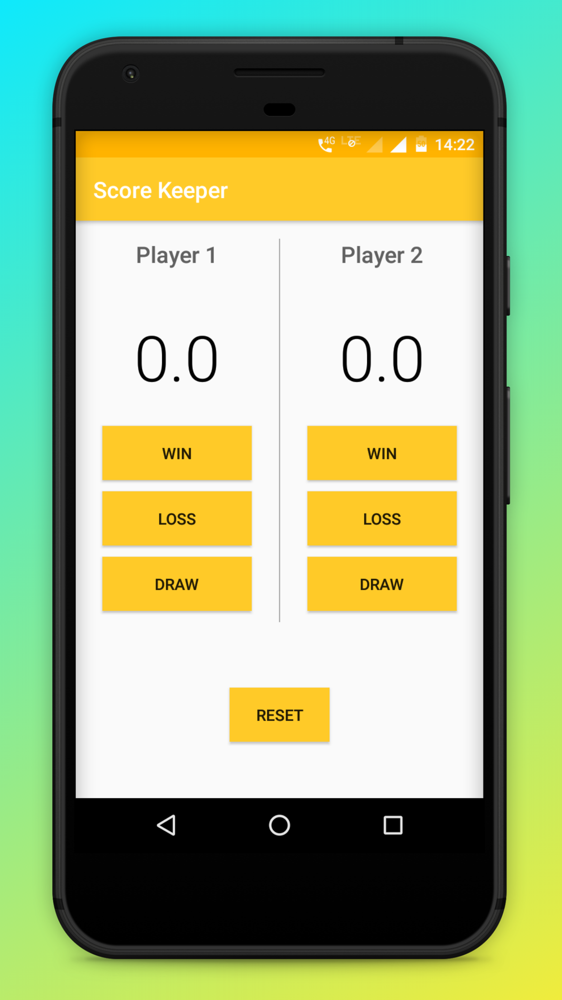

# Score-Keeper-App
Android Basics by Google Nanodegree Program - Udacity

## Project Overview
This project combines everything learned in "User Input" lesson of the Nanodegree program. This app allows a user to keep track of points within a game. Score Keeper app gives a user the ability to keep track of the score of two different teams playing a game of their choice. 
This project is about combining various ideas and skills practised throughout the course. They include:
- Adding button code to the app
- Updating views
- Properly scoping variables
- Finding views by their ID

## ScreenShot

Demo of the app is given as Demo.gif
